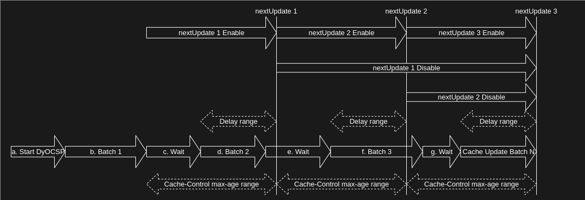

# Response Cache lifecycle

- a. The DyOCSP server and cache generation batch have started.
- b. Caches are generated by the batch process.
    - Now, caches has "nextUpdate 1".
    - "nextUpdate 1" equals "Start time of the batch" + [`cache.interval`](config.md#cache).
    - Now, OCSP response server responds caches having "nextUpdate 1".
- c. Wait for "nextUpdate 2" before proceeding with the [delay](config.md#cache) process.
    - Cache-Control: [max-age](config.md#http) is set by OCSP response server.
      The max-age value should not exceed "nextUpdate 2" if its value is greater than
       "nextUpdate 2".
- d. Caches are generated by the batch process. And old caches are replaced.
    - Now, OCSP response server sends new caches having "nextUpdate 2".
    - "nextUpdate 2" equals "nextUpdate 1" + `cache.interval`.
- e. Wait for "nextUpdate 3" before proceeding with the delay process.
    - Since this batch finished earlier than the specified time in `cache.delay`, it requires
      additional waiting time to synchronize the scheduling.
- f. Caches are generated by the batch process. And old caches are replaced.
    - This batch exceeded "nextUpdate 3". As a result, the OCSP Response Server
      responds "[unauthorized](https://www.rfc-editor.org/rfc/rfc6960#section-2.3)" because the old cache has remained beyond the exceeded period, nextUpdate3.
- g. Wait for "nextUpdate N" before proceeding with the delay process.
    - Since this batch finished later than the specified time in `delay`, the
     waiting time needs to be reduced to synchronize the scheduling.
- Continue these loops.
