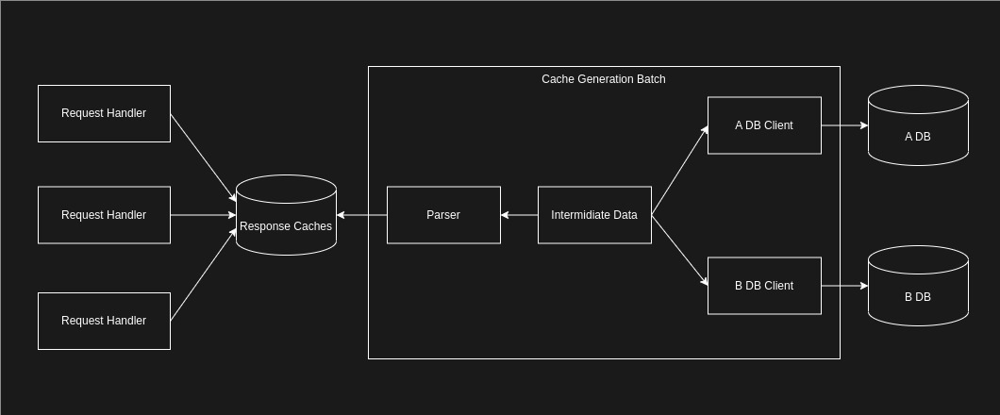

# Overview
DyOCSP aims to be an [OCSP Responder](https://www.rfc-editor.org/rfc/rfc6960) for private CAs with the following characteristics:
- Implement [RFC 5019](https://www.rfc-editor.org/rfc/rfc5019) specification.
- Give various options for background DBs with revocation information.

In concrete implementation, Cache Generation Batch reads revocation information from the DB,
creates a response, and stores the cache in the cache store. From that cache store, the HTTP
handler searches the response cache by the serial number of the OCSP request and returns the OCSP response.

In order to handle the differences in data structures of various databases such
 as SQL, NoSQL, files, etc., the data retrieved by the database client needs to be
 converted into intermediate data as described below.

The data structure and content are based on the `openssl ca` command. (This
 does not imply that the functionality is compatible with OpenSSL.)

### CA Name
The CA name. CA Name. This field does not represent the subject name of the certificate; instead, it is intended to be used as the unit of data management in the database. (e.g. root-ca).
### Serial Number
The Certificate [serial number](https://www.rfc-editor.org/rfc/rfc5280#section-4.1.2.2). In DyOCSP, the serial number is provided as a case-insensitive hexadecimal text [a-fA-F0-9]+.
### Revocation Type
A single character is used to indicate the revocation status of the certificate. It is case-sensitive. DyOCSP accepts only the following three types.
- "V" indicates that a certificate is valid (good) and must not have a "Revocation Date" and "CRLReason" associated with it.
- "R" indicates that a certificate is revoked and must have a "Revocation Date" and "CRLReason" associated with it.
- "E" indicates that an expiration date has passed. This type of revocation information is ignored by DyOCSP, and no response is created.
### Expiration Date
The expiration date for the certificate. [UTCTime](https://www.rfc-editor.org/rfc/rfc5280#section-4.1.2.5.1) or [GeneralizedTime](https://www.rfc-editor.org/rfc/rfc5280#section-4.1.2.5.2).
In the default setting, even if the Expiration Date is exceeded, a certificate
is considered valid as long as the Revocation Type is set to "V".
Users should periodically update the database and change the status of expired certificates to "E" or delete them.
Configuration allows for the caching of responses to be disabled for
certificates that have exceeded their expiration dates. It is important to note that this
setting does not mean that the certificate's status is considered revoked. It simply
means that the response will not be created.
### Revocation Date
The revocation date for the certificate.
### CRLReason
The [CRL Reason](https://www.rfc-editor.org/rfc/rfc5280#section-5.3.1) text. It is case-sensitive.
- unspecified
- keyCompromise
- CACompromise
- affiliationChanged
- superseded
- cessationOfOperation
- certificateHold
- removeFromCRL
- privilegeWithdrawn
- AACompromise
